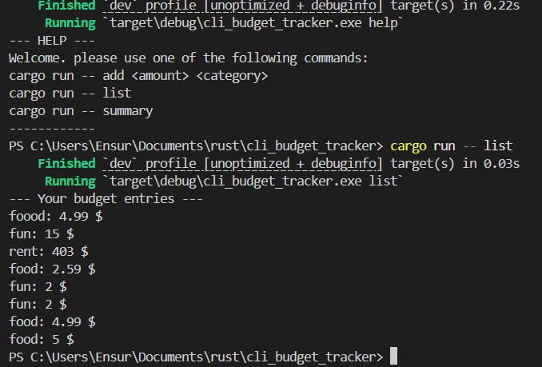

# cli Budget Tracker

[](https://opensource.org/licenses/MIT)

tiny Rust command line tool i'm using to bully my spending habbits.  
you run it from the terminal, tell it what you did with your money, and it yells back at you if you type nonsense.


---

## Tech Stack

- Language: Rust
- Main libs/frameworks: REPLACE_ME_IDIOT

---

## Features


- add
  
validates amount |
 writes entries to budget.csv |
 prints nice formatted output

- list

opens budget.csv |
 prints every entry cleanly |
 basically a tiny file viewer for my financial crimes

- summary
  
reads the whole CSV file into a string |
 total spend + category breakdown coming soon |
 right now it just prints the raw file so i can see what i’m working with 
- help

  shows you all the different commands available
  

- make it prettier... eventually.. maybe next year..

---

### Installation
You need Rust + Cargo installed.
```bash
# clone the repo
git clone https://github.com/USERNAME/REPO_NAME.git
cd REPO_NAME


git clone https://github.com/CodeWithCompound/cli_budget_tracker.git
cd cli_budget_tracker
